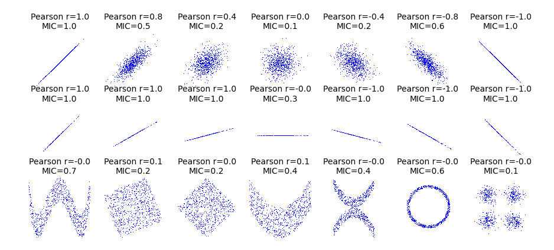

	.. py:module:: minepy

Python API
==========

.. autoclass:: MINE(alpha=0.6, c=15, est="mic_approx")

  .. automethod:: compute_score(x, y)
  .. automethod:: mic()
  .. automethod:: mas()
  .. automethod:: mev()
  .. automethod:: mcn(eps=0)
  .. automethod:: mcn_general()
  .. automethod:: gmic(p=-1)
  .. automethod:: tic(norm=False)
  .. automethod:: get_score()
  .. automethod:: computed()

Convenience functions
---------------------

.. autofunction:: pstats(X, alpha=0.6, c=15, est="mic_approx")
.. autofunction:: cstats(X, Y, alpha=0.6, c=15, est="mic_approx")

First Example
-------------
The example is located in ``examples/python_example.py``.

.. literalinclude:: ../../examples/python_example.py
   :language: python

Run the example:

.. code-block:: sh

   $ python python_example.py
   Without noise:
   MIC 1.0
   MAS 0.726071574374
   MEV 1.0
   MCN (eps=0) 4.58496250072
   MCN (eps=1-MIC) 4.58496250072
   GMIC 0.779360251901
   TIC 67.6612295532

   With noise:
   MIC 0.505716693417
   MAS 0.365399904262
   MEV 0.505716693417
   MCN (eps=0) 5.95419631039
   MCN (eps=1-MIC) 3.80735492206
   GMIC 0.359475501353
   TIC 28.7498326953

Second Example
--------------
The example is located in ``examples/relationships.py``.

.. warning::
   	Requires the `matplotlib <http://matplotlib.org>`_ library.

.. literalinclude:: ../../examples/relationships.py
   	:language: python

Convenience functions example
-----------------------------

The example is located in ``examples/python_conv_example.py``.

.. literalinclude:: ../../examples/python_conv_example.py
   	:language: python

.. code-block:: sh

		$ python python_conv_example.py
		normalized TIC_e (X):
		[ 0.01517556  0.00859132  0.00562575  0.01082706  0.01367201  0.0196697
		  0.00947777  0.01273158  0.011291    0.01455822  0.0072817   0.01187837
		  0.01595135  0.00902464  0.00974791  0.00952264  0.01806944  0.01064587
		  0.00808622  0.01075486  0.00943122  0.01116569  0.01380142  0.01590193
		  0.02159243  0.01450488  0.01347701  0.01036625]
		MIC_e (X vs. Y):
		[[ 0.0175473   0.01102385  0.01489008  0.02957048]
		 [ 0.01294067  0.02682975  0.02743612  0.02224291]
		 [ 0.01613576  0.0175808   0.01633154  0.02633199]
		 [ 0.02090252  0.01680651  0.01735732  0.02186021]
		 [ 0.01350926  0.01002233  0.02128154  0.02036634]
		 [ 0.01459962  0.020248    0.0319421   0.01782455]
		 [ 0.01186273  0.0291112   0.01577821  0.01970322]
		 [ 0.012531    0.02071883  0.01536824  0.03312674]]
